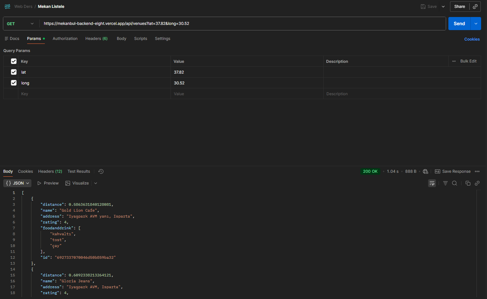
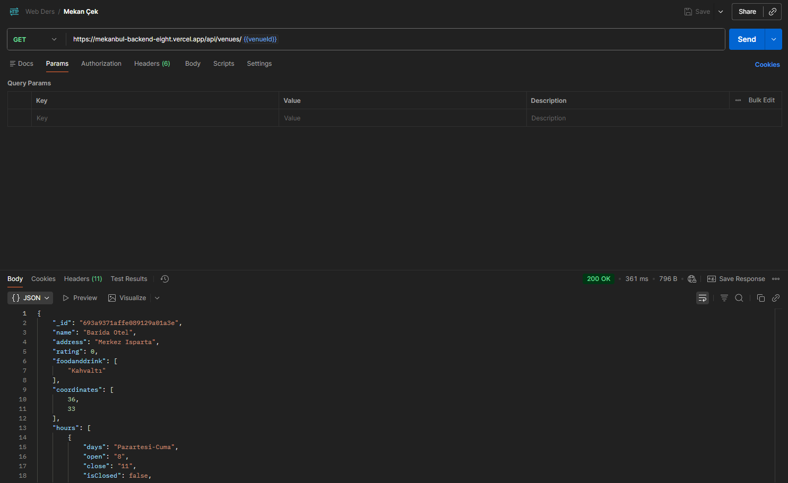
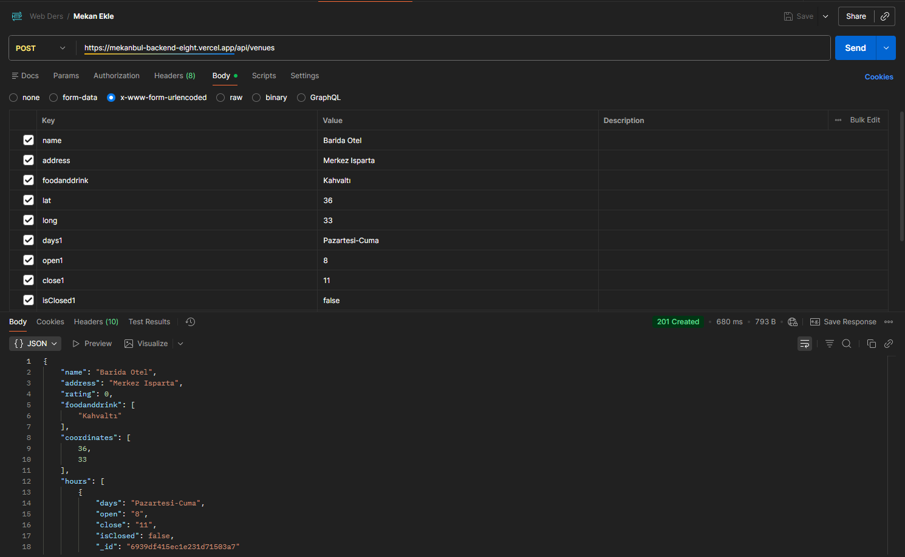
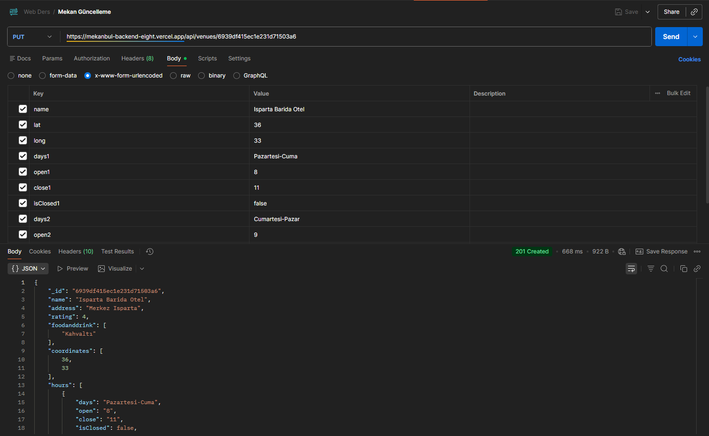
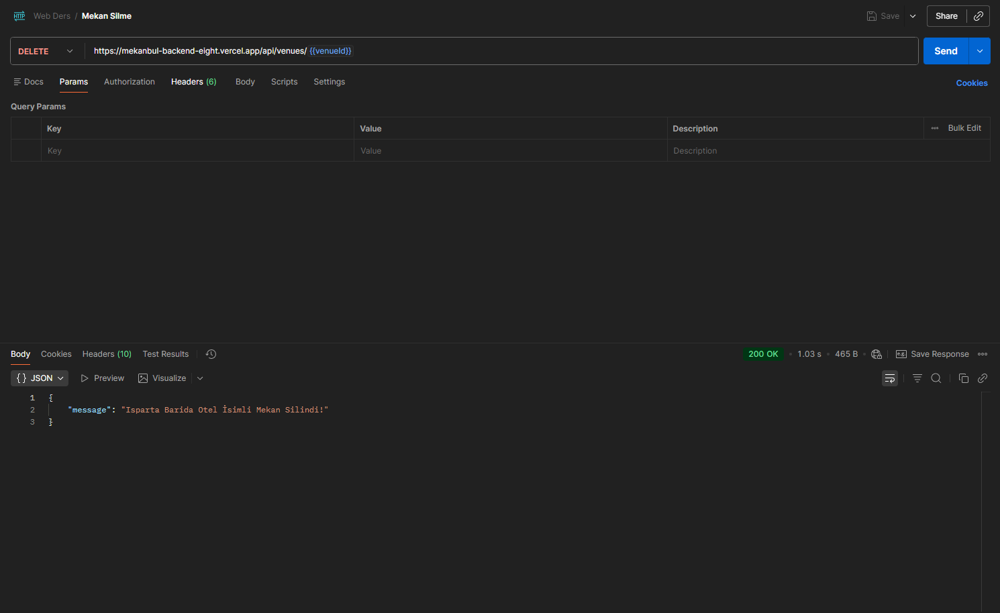
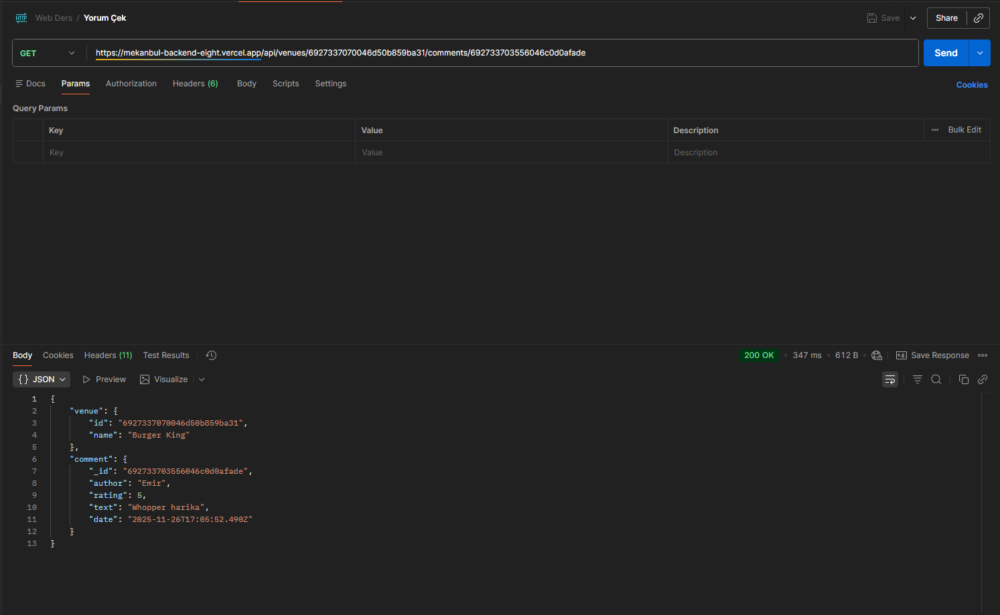
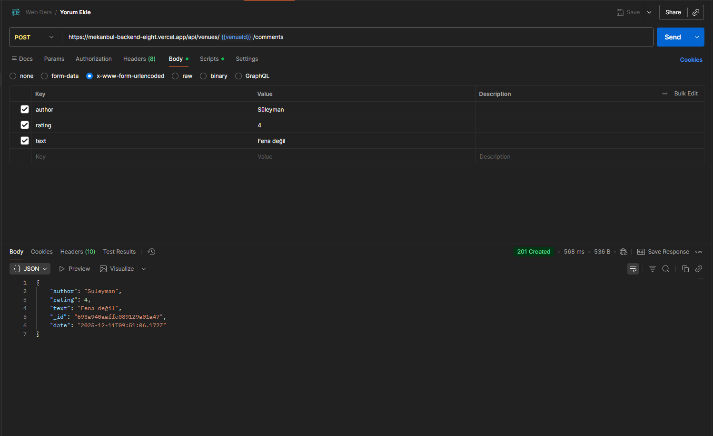
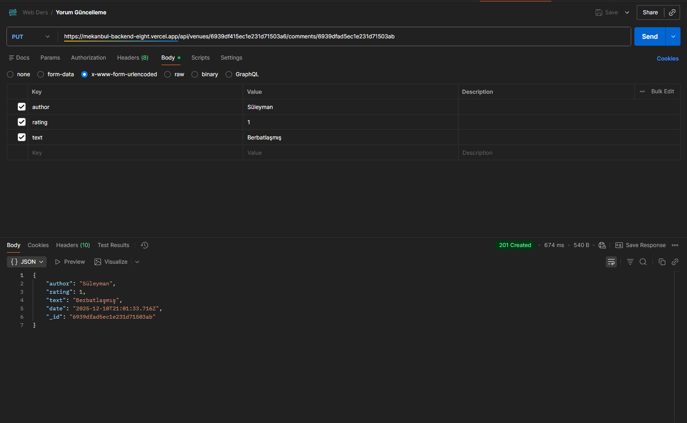
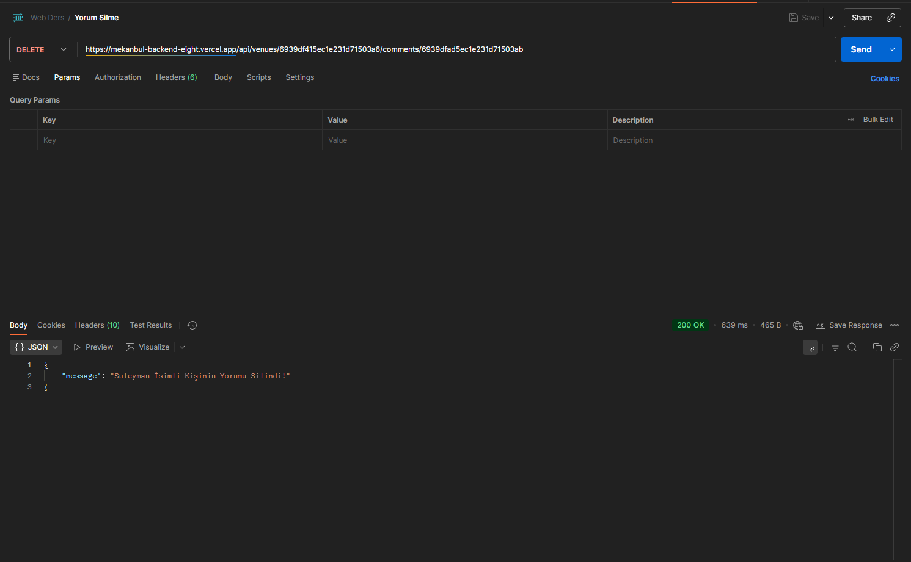

# Mekanbul Backend

## 🌐 Demo Linki: https://mekanbul-backend-eight.vercel.app/

Bu proje **Web Teknolojileri ve Programlama** dersi **Ödev-3** ve **Ödev-5** sunumu için hazırlanmıştır

Ders için proje kapsamında geliştirilen **Mekanbul** uygulamasının **MongoDB** veritabanı ile etkileşimini sağlamak için
oluşturulmuştur.<br>

### Kısaca Özellikleri

- **Mekan & Yorum** Ekleme / Çekme / Güncelleme / Silme
- **MongoDB Atlas** kullanımı

### Kurulum & Çalıştırma

```bash
npm install

npm start
```

### API Endpoints

| Method     | Endpoint                              | Açıklama                    |
|------------|---------------------------------------|-----------------------------|
| **GET**    | `/api/venues`                         | Yakındaki mekanları listele |
| **GET**    | `/api/venues/:id`                     | ID’ye göre mekan detayı çek |
| **POST**   | `/api/venues`                         | Yeni mekan ekle             |
| **PUT**    | `/api/venues/:id`                     | Mekan güncelle              |
| **DELETE** | `/api/venues/:id`                     | Mekan sil                   |
| **GET**    | `/api/venues/:id/comments/:commentId` | ID'ye göre yorum detayı çek |
| **POST**   | `/api/venues/:id/comments`            | Yeni yorum ekle             |
| **PUT**    | `/api/venues/:id/comments/:commentId` | Yorum güncelle              |
| **DELETE** | `/api/venues/:id/comments/:commentId` | Yorum sil                   |

### Postman Testi Sonuçları









